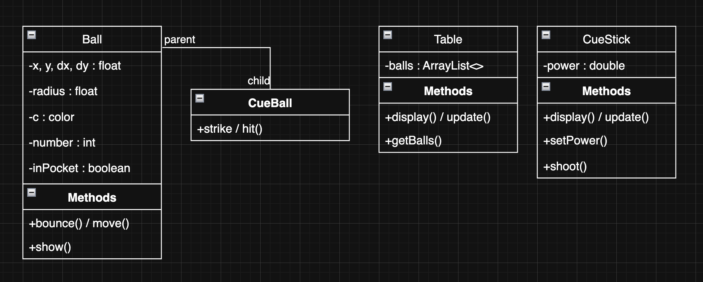

# Technical Details:

Period 5 : Kayden Au & Alvaro Hernandez Jenaro

Group Name : Pooligans

Brief Project Description :
    A repilicate of the hit game 8-Ball/Billiards. This will include the use of the cue stick to hit balls, motion and collision of balls within the bounds of the board, and also the solid/stripes rule based system. Additionally, there will also include a turn based system between two players, and a tracker for the number of balls. 

Expanded Description :
    Critical Features - visible board, cue stick, balls ; basic 2D collision and projectile motion ; established rule set between stripes and solids, which player is which 
    Nice to have Features - spin on the cue ball ; motion and collision using 3D sphere physics
     
# Project Design

UML Diagrams and descriptions of key algorithms, classes, and how things fit together.

### UML Diagram ###

# Intended pacing:

### Ball Class and Basic Collision Physics -- To be done by Tuesday, May 21st
- [ ] Add color and number to each ball
- [ ] Implement vector functionality
- [ ] Add basic collision, will be done by finding the vector in between two balls when they are close enough and transfering velocity. (Assuming perfectly elastic collisions and no spin for now)
- [ ] Add friction

### Stick Class

### Implement pockets with the Table Class

How you are breaking down the project and who is responsible for which parts.

A timeline with expected completion dates of parts of the project. (CHANGE THIS!!!!!)

