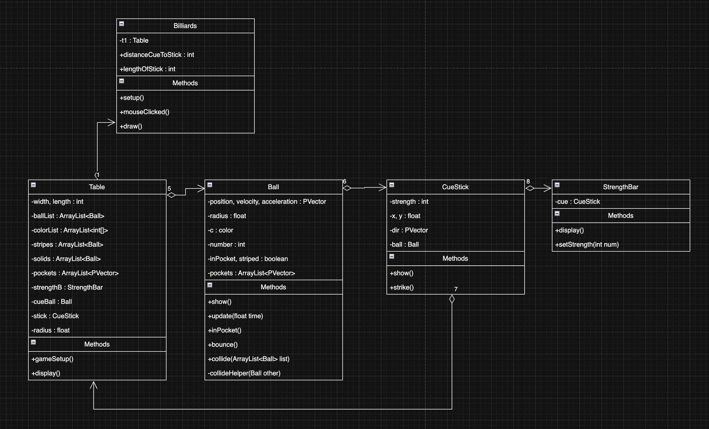

# Technical Details:

Period 5 : Kayden Au & Alvaro Hernandez Jenaro

Group Name : Pooligans

Brief Project Description :
    A replicate of the hit game 8-Ball/Billiards. This will include the use of the cue stick to hit balls, motion and collision of balls within the bounds of the board, and also the solid/stripes rule based system. Additionally, there will also include a turn based system between two players, and a tracker for the number of balls.

Expanded Description :
    Critical Features - visible board, cue stick, balls ; basic 2D collision and projectile motion ; established rule set between stripes and solids, which player is which   
    Nice to have Features - spin on the cue ball ; motion and collision using 3D sphere physics

# Project Design

UML Diagrams and descriptions of key algorithms, classes, and how things fit together.

### UML Diagram ###

# Intended pacing:

> Note: You have to add an x in between brackets to check off an item

Alvaro will work on the visuals and piecing the game together.
Kayden will work on the physics behind the game.

### Ball Class and Basic Collision Physics -- To be done by Tuesday, May 27th
- [x] Add color and number to each ball
- [x] Implement vector functionality
- [x] Add basic collision, will be done by finding the vector in between two balls when they are close enough and transfering velocity. (Assuming perfectly elastic collisions and no spin for now)
- [x] Add friction

### Stick Class -- To be done by Friday, May 30th - Kayden
- [ ] Establish an incremental way to hit a ball with differing levels of force
- [x] Find angle from tip of stick to cue ball
- [ ] Apply Vector with correct force
- [x] Show the stick as you move it around the cue ball--will always have a direct line to the center of the cue ball

### Implement pockets with the Table Class -- To be done by Monday, June 2nd
- [x] Make appropriately sized pockets--potential to change size depending on difficulty
- [ ] Remove collision of the walls around the pocket and check when the center of a ball excedes a certain coordinate.
- [x] Make the table look recognizable as a pool table

### Bring the game together -- To be done by Wednesday, June 4th
- [ ] Make sure the game reacts accordingly to which ball has been pocketed--if it is the black one, instant loss; if it is the cue ball, have it reset the ball; if it is your respective teams color, give the player another turn
- [ ] Display the force level of the stick class as a vertical bar
- [ ] Perhaps have a way to toggle the difficulty by altering the sizes of the pockets
- [ ] Have a reset button
- [ ] Initialize the game in the correct way:

^ Initial state of game
